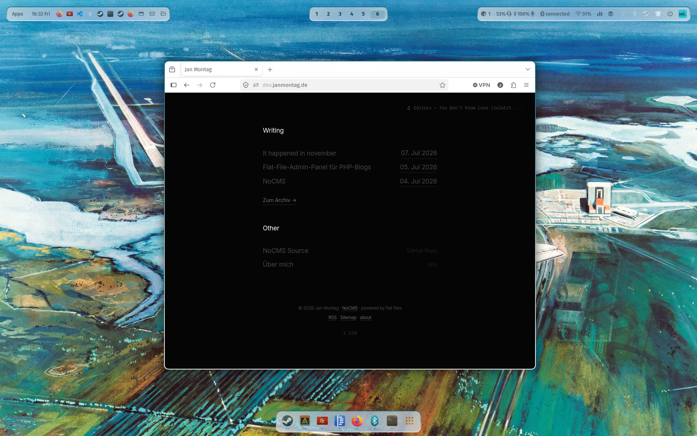

# NoCMS — Minimal Flat-File Blog Engine

NoCMS ist ein radikal minimalistisches, datenbankloses Content-Management-System in nativem PHP. Entwickelt für maximale Performance, absolute Portabilität und puren Fokus auf den Text.

 <!-- Ersetze dies später durch deinen neuen Screenshot-Pfad, z.B. ./screenshot.png -->

## Features

- **Flat-File-Architektur:** Beiträge werden komplett als Markdown-Dateien mit YAML-Frontmatter gespeichert. Keine Datenbank benötigt.
- **Pure-Theme:** Ein von Denis-Moulin inspiriertes, tiefschwarzes (AMOLED-friendly) Design mit gestapelten Listen und feinen Monospace-Akzenten.
- **Asynchrones Admin-Panel:** Native `admin.php` mit Drag-and-Drop/AJAX-Bildupload direkt in den Markdown-Editor ohne Page-Reload.
- **Dynamische Feeds:** Automatische Generierung von valider `sitemap.xml` und `feed.xml` (RSS).
- **Pretty URLs:** Sauberes URL-Routing nativ über den Caddy-Webserver.
- **Last.fm-Integration:** Asynchrones Live-Widget oben rechts, das deinen aktuellen Soundtrack direkt von Last.fm streamt.

## Setup & Caddy-Konfiguration

Für die schönen URLs und die Absicherung des Admin-Panels wird folgende Konfiguration im `Caddyfile` genutzt:

```caddy
dev.janmontag.de {
    root * /var/www/dev.janmontag.de
    
    # Passwortschutz für das Admin-Interface
    basicauth /admin.php {
        thafaker <dein_passwort_hash>
    }

    php_fastcgi unix//var/run/php/php8.3-fpm.sock
    encode zstd gzip

    # Schöne URLs für die Markdown-Beiträge
    @clean_urls {
        not file {path} {path}/
        not path /admin.php /assets* /inc* /posts* /feed.xml /sitemap.xml
    }
    rewrite @clean_urls /post.php?slug={path}
}
```

---

### 3. Der Git-Workflow im Terminal

Logge dich auf deinem Hetzner-Server ein, wechsle in das Verzeichnis und führe die folgenden Befehle aus, um einen neuen Branch zu erstellen, den Screenshot hinzuzufügen und alles sauber zu pushen:

```bash
# 1. Wechsle in dein Entwicklungs-Verzeichnis
cd /var/www/dev.janmontag.de

# 2. Erstelle einen neuen Branch für das Design (z.B. "theme-pure") und wechsle dorthin
git checkout -b theme-pure

# 3. Kopiere deinen Screenshot in das Verzeichnis (falls noch nicht geschehen)
# Speicher ihn am besten direkt als "screenshot.png" im Hauptverzeichnis ab.

# 4. Überprüfe, welche Dateien geändert wurden
git status

# 5. Füge alle Änderungen (Caddyfile, index.php, style.css, lastfm.php, README.md, Screenshot) hinzu
git add .

# 6. Erstelle einen sauberen Commit
git commit -m "Feat: Add minimal Pure theme, fix mobile layouts, integrate Last.fm and update README"

# 7. Pushe den neuen Branch hoch zu GitHub
git push origin theme-pure
```